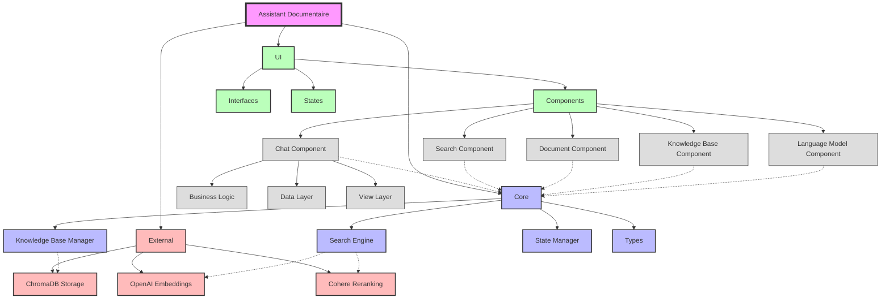

```mermaid
graph TB
    %% Main Application
    A[Assistant Documentaire] --> B[Core]
    A --> C[UI]
    A --> D[External]

    %% Core Components
    B --> B1[Knowledge Base Manager]
    B --> B2[Search Engine]
    B --> B3[State Manager]
    B --> B4[Types]

    %% UI Components
    C --> C1[Components]
    C --> C2[Interfaces]
    C --> C3[States]

    %% Components Detail
    C1 --> D1[Chat Component]
    C1 --> D2[Search Component]
    C1 --> D3[Document Component]
    C1 --> D4[Knowledge Base Component]
    C1 --> D5[Language Model Component]

    %% Component Layers
    D1 --> E1[Business Logic]
    D1 --> E2[Data Layer]
    D1 --> E3[View Layer]

    %% External Services
    D --> F1[OpenAI Embeddings]
    D --> F2[Cohere Reranking]
    D --> F3[ChromaDB Storage]

    %% Data Flow
    B1 -.-> F3
    B2 -.-> F1
    B2 -.-> F2
    D1 -.-> B
    D2 -.-> B
    D3 -.-> B
    D4 -.-> B
    D5 -.-> B

    %% Styling
    classDef main fill:#f9f,stroke:#333,stroke-width:4px
    classDef core fill:#bbf,stroke:#333,stroke-width:2px
    classDef ui fill:#bfb,stroke:#333,stroke-width:2px
    classDef external fill:#fbb,stroke:#333,stroke-width:2px
    classDef component fill:#ddd,stroke:#333,stroke-width:1px
    
    class A main
    class B,B1,B2,B3,B4 core
    class C,C1,C2,C3 ui
    class D,F1,F2,F3 external
    class D1,D2,D3,D4,D5,E1,E2,E3 component
```
